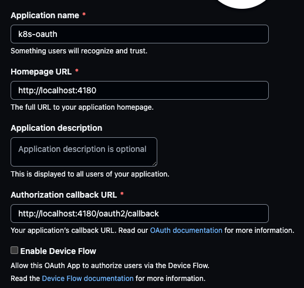

# Minimal OAuth

How to use the [Oauth2 Proxy](https://oauth2-proxy.github.io/oauth2-proxy/docs/) to serve a static site with minimal infra and dependencies on a single VM.  In this case, I'm going to serve a simple [Quarto](https://quarto.org/) site (my favorite static site generator).


## Steps

### 1. Generate the static site

First, install [Quarto](https://quarto.org/), and run the following command:

```bash
quarto render
```

This will create a static site in the `_site/` folder.

### 2. Create an OAuth App

Create an [OAuth App](https://github.com/settings/applications/new), but fill out the fields like this for local testing:



Make sure you store the `Client ID` and `Client Secret` into the enviornment variables `OAUTH2_PROXY_CLIENT_ID` and `OAUTH2_PROXY_COOKIE_SECRET`, respectively.

### 3. Start The Proxy + WebServer Locally

First, add your email address to [emails/email_list.txt](./emails/email_list.txt) to whitelist yourself.  The OAuth2 proxy uses this list to determine who is authorized to see your site.  There are many other authorization schemes in addition to an email whitelist, [which you can read about here](https://oauth2-proxy.github.io/oauth2-proxy/docs/configuration/overview).

Next, generate a cookie secret by running `python -c 'import os,base64; print(base64.urlsafe_b64encode(os.urandom(32)).decode())'` and store that value in the `OAUTH2_PROXY_COOKIE_SECRET` environment variable.

Next, run the following command from this directory:

```bash
docker run -v $(PWD)/_site:/app \               # the directory with the static site
           -v $(PWD)/emails:/site_config \      # the dirctory with the email list
           -p 4180:4180 -p 4443:4443 \          # bind the ports
           quay.io/oauth2-proxy/oauth2-proxy \  # the official docker image for Oauth2 proxy
           --provider github \                  # use GitHub as the Oauth provider
           --upstream file:///app/#/ \          # The location of the static site files
           --http-address=:4180 \               # Bind the 4180 port on all interfaces (necessary for Docker)
           --https-address=:4443 \              # Bind the 4443 port for https traffic (we won't be using this when testing locally)
           --authenticated-emails-file /site_config/email_list.txt \  # This is the email whitelist
           --scope user:email \                 # This tells the Oauth provider, which is GitHub to share your email with your app
           --cookie-expire 0h0m30s \            # Optional: This helps the cookie expire more quickly which could be helpful for security
           --session-cookie-minimal true \      # Optional: don't store uncessary info in cookie since we aren't using that
           --skip-provider-button true \        # Don't need a seperate "login with GitHub" screen
           --cookie-secret $OAUTH2_PROXY_COOKIE_SECRET \  # This is the secret you pass, see https://oauth2-proxy.github.io/oauth2-proxy/docs/configuration/overview
           --client-id $OAUTH2_PROXY_CLIENT_ID \          # This is the ID of your Oauth App from GitHub
           --client-secret $OAUTH2_PROXY_CLIENT_SECRET \  # This is the secret of your Oauth App from GitHub
           # THE BELOW FLAGS ARE ONLY FOR LOCAL TESTING \
           --redirect-url="http://localhost:4180/oauth2/callback" \  # this is necessary for local testing only
           --cookie-secure=false \                                   # this is necessary for local testing only
           --cookie-csrf-per-request=true \                          # this is necessary for local testing only
           --cookie-csrf-expire=5m                                   # this is necessary for local testing only
```

Note how the OAuth2 Proxy doubles as a webserver also!  That is what `--upstream` flag enables.


### 4. Test Security / Access

There is a file named [emails/email_list.txt](./emails/email_list.txt) that contains a list of the email identities that are allowed to view your site.  Try misspelling your email on purpose and see what happens when you do a hard refresh after a few seconds.  Try changing it back.


## Next Steps

Now that you have a minimal idea of how this works locally, you can proceed to host your static site on a VM.  This is great for a static site that you want to be private (private documentation, a paid course you want to offer, etc.).  

### Kubernetes

I show how to do this same thing on Kubernetes [here](../README.md).  That example:

- Deploys a static site on Kubernetes behind a load balancer, with the Oauth proxy
- Sets up automated SSL for https with Google Managed Certificates

Deploying this on Kubernetes is much more complicated, maybe the most complicated way to deploy this (but is something I wanted to play with).  Now that you understand the basics of how this works from this local example, you can deploy this however you want. 
