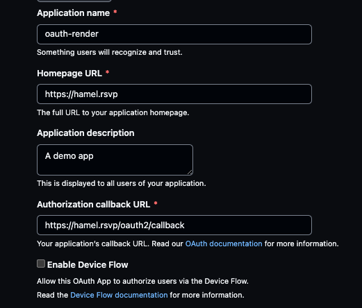

# Serving Your Site

We are going to serve a [Quarto](https://quarto.org/) site behind an OAuth proxy to make it private, as [described here](../README.md).

## Prerequisites

1. You have taken the [first tutorial](../local/README.md).

2. A custom domain that you don't mind experimenting with.  If you don't have one, you can [buy one here](https://domains.google.com). In this example, I'm using the custom domain `hamel.rsvp`.

## Render (Free)

[Render](https://render.com/) is a hosting service that provides a generous free tier.  We just have to learn a little bit about their YAML, but if you did the [first tutorial](../local/README.md), it will be approachable.

Render also has [Oauth2 Proxy tutorial](https://render.com/blog/password-protect-with-oauth2-proxy) which is pretty close to what we want.  We are going to simplify that example considerably, while also getting rid of things that aren't free.

### Setup

1. Create another OAuth application and save the `Client ID` and `Client Secret` as you did in the [minimal example](../local/README.md).  You can fill it out like this:



2. [fork this repo](https://github.com/hamelsmu/oauth-render-quarto/tree/main).

3. **Optional:** Change the content of your site by editing one of the `.qmd` files, then run `quarto render` to re-generate the content into the `_site/` folder.  **Make sure you check-in any changes, including the `_site` folder into your repo.**

4. [Click this link to deploy the app](https://dashboard.render.com/blueprints), and grant Render access to the repo you just forked.  Next, fill in values for the `OAUTH2_PROXY_CLIENT_ID` and `OAUTH2_PROXY_CLIENT_SECRET`:


5. Set up your custom domain by navigating to [your dashboard](https://dashboard.render.com/) and clicking on this project, which is named `oauth2-proxy-render` (unless you changed it). On the left-hand side click `Settings`.  Under `Settings`, scroll down to the section named `Custom Domains`.  Add your domain there and follow the instructions.  Render will take care of provisioning an SSL certificate to enable `https` on your domain for you.

### Testing Your Site

Anytime your push a change to your repo, your site will rebuild.  Try misspelling your email in the `email_list.txt` file and see what happens, then try changing it back.  **Warning: if you revoke/grant access, it takes 2-3 minutes for it to take effect, and you may have to clear your cache - be patient!**

### How does it work?

See the [repo's README](https://github.com/hamelsmu/oauth-render-quarto).


### Alternatives to Render

These are some alternatives to Render that work similarly.

- [Fly.io](https://fly.io/).  Doesn't have a free tier, but is anything _really_ free?
- [Railway](https://railway.app/)

## Hosting on A VM

You might not like serverless solutions.  They can often be harder to debug. However, you can host a blog on a VM as well.  Here are some tips if you are hosting things on a VM.

1. You might want to use [Caddy](https://caddyserver.com/) or [Nginx](https://www.nginx.com/) as your web server.  Caddy is easier to use and just as powerful.  Both of these servers facilitate [automatically provisioning SSL certificates](https://caddyserver.com/docs/automatic-https#issuer-fallback) for `https` (but it requires some setup).  Even though OAuth2 Proxy can be a web server itself, it is convenient to put one of these in front of the proxy for the automatic SSL functionality. Furthermore, this setup gives you the flexibility to host a mix of private and public sites from the same VM.

2. If you have a web server that handles SSL for you that forwards traffic to the OAuth2 Proxy, your OAuth2 proxy will likely receive `http` traffic from the web server.  Therefore, you might want to configure your `docker run` command accordingly:

The below command assumes:
- There is an `app/emails` and `app/site` directory in the current directory.
- You have set the `OAUTH2_PROXY_COOKIE_SECRET`, `OAUTH2_PROXY_CLIENT_ID`, and `OAUTH2_PROXY_CLIENT_SECRET` environment variables.

```bash
docker run -v $(pwd)/app/site:/app \
-v $(pwd)/app/emails:/site_config \
-p 4180:4180 \
quay.io/oauth2-proxy/oauth2-proxy \
--provider github \
--upstream "file:///app/#/" \
--http-address=":4180" \
--authenticated-emails-file "/site_config/email_list.txt" \
--scope user:email \
--cookie-expire 0h0m30s \
--session-cookie-minimal true \
--skip-provider-button true \
--cookie-secret $OAUTH2_PROXY_COOKIE_SECRET \
--client-id $OAUTH2_PROXY_CLIENT_ID \
--client-secret $OAUTH2_PROXY_CLIENT_SECRET \
--cookie-csrf-per-request=true
```

In the above example, you would have your webserver forward traffic to `localhost:4180`.

3. Use [rsync](https://linuxize.com/post/how-to-use-rsync-for-local-and-remote-data-transfer-and-synchronization/) to update your static site or email white list when necessary. For example, this is how I would sync my local files with my VM in this case:

```bash
rsync -a email_list.txt myvm:/home/ubuntu/app/emails/
rsync -a _site/* myvm:/home/ubuntu/app/site
```

I recommend updating your `~/.ssh/config` file so that you can reference your VM with a name like `myvm`, as shown above. For example, this is the relevant part of my `~/.ssh/config`, which has the IP, username, and location of the private key I need to access my VM.

```
Host myvm
  HostName 111.22.333.44 # your VM's Public IP Address
  User ubuntu            # The username you need to login
  IdentityFile /Users/hamelsmu/.ssh/vm_private_key.rsa
```


# Next Steps

As an advanced exercise, I show how to do this [same thing on Kubernetes](../gke_k8s/README.md). That example:

- Deploys a website on Kubernetes behind a load balancer with the OAuth proxy.
- Sets up automated SSL for `https` with Google Managed Certificates
- Deploys a separate webserver for the website to make the pattern more generalizable.

Deploying this on Kubernetes is much more complicated, but is something I wanted to play with.

**:point_right: [See Lesson 3: Deploying The OAuth2 Proxy On Kubernetes](../simple/README.md). :point_left:**
